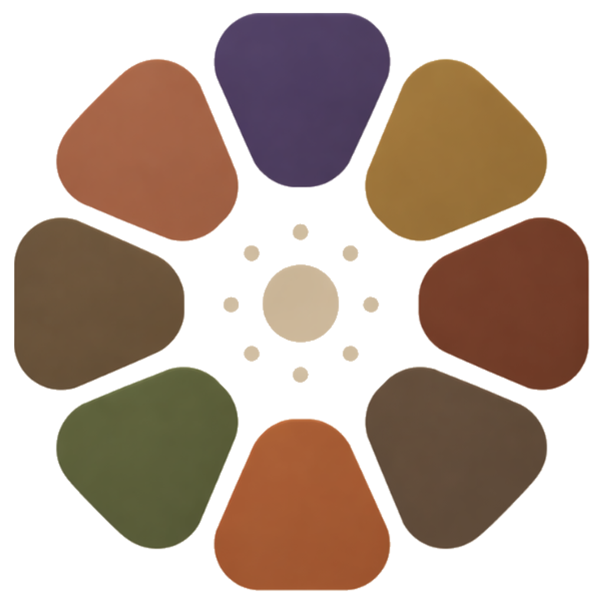

<div align="center">
  

  # Jurni

  **A dashboard for your life.**

  Local-first. AI-powered. Open source.

  [Download](https://github.com/abehairy/jurni-os/releases/latest) ·
  [Website](https://abehairy.github.io/jurni-os) ·
  [Architecture](./ARCHITECTURE.md) ·
  [Contribute](./CONTRIBUTING.md)
</div>

---

Jurni ingests your conversations, social posts, calendar and photos, and turns
them into a living picture of your life — the people you talk about, the
projects you're building, the topics you return to, the tone of each week.

Everything stays on your machine. We never see your data.

## Why

You already generate a dense record of your life every day — across Claude,
ChatGPT, X, LinkedIn, WhatsApp, your calendar, your photos. Each tool holds a
fragment. Nothing holds the whole.

Jurni is the whole. A local dashboard that reads across all those sources and
surfaces what actually matters: who you care about, what you're working on,
how you're feeling, what patterns are emerging, what's changed this week.

No cloud. No account. No sales pitch. Your LLM key, your machine, your data.

## Status

Alpha. Shipping for macOS first. The pipeline is stable; connectors are
being hardened one by one.

| Connector | Status |
|---|---|
| Claude | Ready |
| ChatGPT | Ready |
| X (Twitter) | Works — feed + your own posts |
| LinkedIn | Works — own posts captured, feed selectors still being tuned |
| Instagram | Wired, unverified |
| Facebook | Wired, unverified |
| macOS Calendar | Planned |
| macOS Photos | Planned |
| Notion / Obsidian | Planned |

## Install

Download the latest `.dmg` from the [Releases
page](https://github.com/abehairy/jurni-os/releases/latest) and drag
Jurni into **Applications**.

**Alpha note — first launch on an unsigned build:** right-click
(or Ctrl-click) `Jurni.app` → **Open** → **Open** again in the dialog.
macOS only asks once per machine. (Once we have a full Apple Developer
Program membership active, v0.1.1 will be signed + notarized + auto-updating
and this step goes away.)

> You'll need an [OpenRouter](https://openrouter.ai) API key (or
> equivalent LLM key) the first time you run it. Jurni stores it locally
> in `~/.jurni/`; no telemetry, no proxy.

## Build from source

```bash
git clone https://github.com/abehairy/jurni-os.git
cd jurni
npm install
npm run dev
```

Requires Node 18+ and macOS. Everything hot-reloads — edit React files,
changes appear; edit main-process files, restart with `rs` in the dev terminal.

To build a local `.dmg`:

```bash
npm run release:dry
```

The DMG lands in `release/`. It won't auto-update (that requires signing —
see [RELEASE.md](./RELEASE.md)).

## How it works

```
┌────────────┐   ┌──────────────────────────┐   ┌───────────────────┐
│ CONNECTORS │ → │ INGEST                   │ → │ moments           │
│ (registry) │   │ kind ← registry[provider]│   │ + kind column     │
│  browser-  │   │ author ← preload         │   │ + author column   │
│  based     │   └──────────────────────────┘   └─────────┬─────────┘
└────────────┘                                            │
                                                          ▼
                    ┌──────────────────────────────────────────┐
                    │ PROCESS (LLM)                            │
                    │   split by (kind, author)                │
                    │   profile = KIND_PROFILES[kind]          │
                    │   → entities, patterns, emotions         │
                    │   self-authored mentions weighted ×3     │
                    └─────────┬────────────────────────────────┘
                              │
                              ▼
                    ┌───────────────────────┐
                    │ CATEGORIZE (threads)  │
                    │ kind = 'dialogue'     │
                    │ → topic, domain, tone │
                    └───────────┬───────────┘
                                │
                                ▼
                        ┌───────────────┐
                        │  LANDSCAPE    │
                        │  treemap UI   │
                        └───────────────┘
```

See [ARCHITECTURE.md](./ARCHITECTURE.md) for the full technical breakdown.

## Privacy

- Everything lives in `~/.jurni/` on your Mac. Database, logs, crawler
  sessions, LLM cache.
- The only outbound traffic is (a) your LLM provider for analysis calls, and
  (b) GitHub for update checks.
- No analytics. No telemetry. No crash reports home.
- Uninstall = delete `~/.jurni/` and drag the app to Trash. That's it.

See [SECURITY.md](./SECURITY.md) for how to report vulnerabilities.

## Contribute

Jurni is built to be extended. Adding a new data source is intentionally
small:

1. Add a row to `electron/connectors/registry.js` (id, URL, `kind`).
2. Add a preload hook in `channels/browser-preload.js` if it's a browser source.
3. Ship it — pipeline, processor, and UI pick it up automatically.

Start with [CONTRIBUTING.md](./CONTRIBUTING.md) for local setup,
conventions, and the PR workflow. Ideas of where to help:

- LinkedIn feed selector tuning
- Instagram + Facebook verification
- macOS Calendar / Photos native connectors
- Landscape UI polish
- Windows / Linux ports
- Entity resolution across data sources (one "Elon Musk", not three)
- Per-entity briefings (what does Jurni say about *this* person?)

## License

MIT — see [LICENSE](./LICENSE). Build on it, fork it, ship your own version.

## Landing page

The marketing site at [abehairy.github.io/jurni-os](https://abehairy.github.io/jurni-os)
is a single `docs/index.html` file served via GitHub Pages. To deploy
changes: push to `main` — Pages picks it up from `docs/` automatically
(once enabled in repo Settings → Pages → Source: `main` / `/docs`).

## Maintainer

Built by [Everest Minds for Programming](https://everestminds.com). Lead:
Ahmed Behairy ([@behairy](https://github.com/behairy)).
